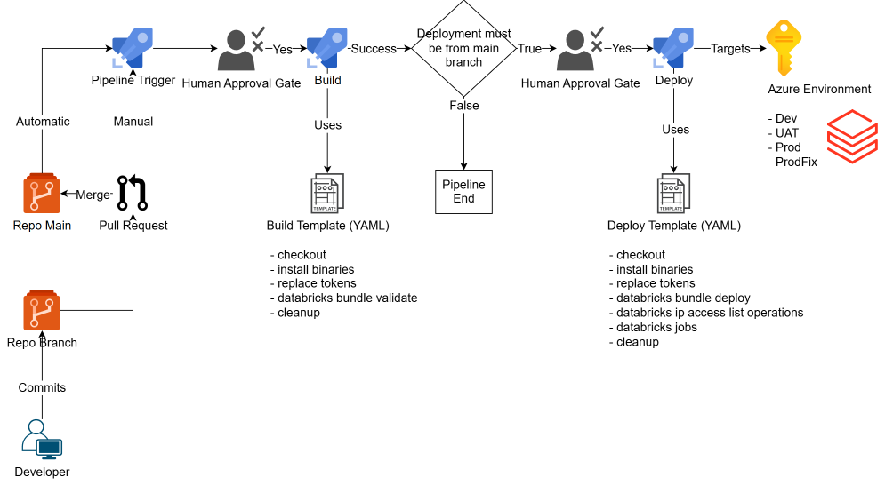

### [View all Roadmaps](https://github.com/nholuongut/all-roadmaps) &nbsp;&middot;&nbsp; [Best Practices](https://github.com/nholuongut/all-roadmaps/blob/main/public/best-practices/) &nbsp;&middot;&nbsp; [Questions](https://www.linkedin.com/in/nholuong/)
<br/>

[](https://git.io/typing-svg)

# **About Me🇻**
- ✍️ Blogger
- ⚽ Football Player
- ♾️ DevOps Engineer
- ⭐ Open-source Contributor
- 😄 Pronouns: Mr. Nho Luong
- 📚 Lifelong Learner | Always exploring something new
- 📫 How to reach me: luongutnho@hotmail.com


<p align="left">  </p>

This repo contains example Azure Databricks CICD patterns using Databricks CLI and YAML pipelines.

I also wrote a README ([Managing Azure Databricks Workspace IP Access Lists via CICD](docs/IPAccessListsviaCICD.md)) to explain some things used in this repo.

Azure DevOps Pipeline Lifecycle Overview:


## Databricks Workspace Authentication

For Azure Databricks workspace authentication, in this repo I'm using OAuth machine-to-machine (M2M) authentication for unattended access to Databricks resources with a service principal using OAuth. See https://docs.databricks.com/aws/en/dev-tools/auth/oauth-m2m.

### Databricks Asset Bundle (DAB)

These token values for `__ADB_DEV_SPN_ID__` `__ADB_DEV_HOST__` are detected and replaced by the token replacement task in the build and release pipeline templates with the new values driven from secrets in an Azure DevOps Library referenced by the calling pipeline.

```yml
targets:
  dev:
    mode: production
    default: true
    run_as:
      service_principal_name: "__ADB_DEV_SPN_ID__"
    workspace:
      host: "__ADB_DEV_HOST__"
      root_path: /Workspace/${bundle.name}
      auth_type: oauth-m2m
    sync: 
      exclude:
        - devops
```

### Databricks CLI

These environment variable values for `DATABRICKS_HOST`, `DATABRICKS_CLIENT_ID`, and `DATABRICKS_CLIENT_SECRET` which are required for oauth-m2m authentication are passed in from the calling pipeline which references the related Azure DevOps Library secrets.

```yml
# Validate Databricks Bundle
- bash: |
    databricks bundle validate -t ${{ parameters.BUNDLE_TARGET }} --log-level ${{ parameters.DATABRICKS_LOG_LEVEL }}
  env:
    DATABRICKS_HOST: ${{ parameters.ADB_HOST }} #required for oauth-m2m authentication
    DATABRICKS_CLIENT_ID: ${{ parameters.ADB_CLIENT_ID }} #required for oauth-m2m authentication
    DATABRICKS_CLIENT_SECRET: ${{ parameters.ADB_CLIENT_SECRET }} #required for oauth-m2m authentication
  displayName: "Validate ${{ parameters.BUNDLE_TARGET }} Databricks Bundle"
```

```yml
- stage: Build_Dev
  displayName: "Build Dev"
  dependsOn: []
  jobs:
    - template: /devops/templates/ado-build-template.yml@self
      parameters:
        BUNDLE_TARGET: "dev"
        ADB_HOST: $(ADB_DEV_HOST) #value replaced from referenced Azure DevOps Library secret
        ADB_CLIENT_ID: $(ADB_DEV_SPN_ID) #value replaced from referenced Azure DevOps Library secret
        ADB_CLIENT_SECRET: $(ADB_DEV_SPN_SECRET) #value replaced from referenced Azure DevOps Library secret
        DATABRICKS_SDK_VERSION: ${{ variables.DATABRICKS_SDK_VERSION }}
        DATABRICKS_LOG_LEVEL: ${{ variables.DATABRICKS_LOG_LEVEL }}
        ADO_ENVIRONMENT: "Dev-Databricks" #Update this to desired environment name in Azure DevOps
        AGENT_POOL: ${{ variables.AGENT_POOL }}
```

## Databricks Workspace IP Access Lists

The `./workspace-ip-access-lists` folder in this repo contains the `.json` files that are used by the `ado-release-template.yml` devops template file to manage IP access lists for the workspace respective to each databricks environment.

Key References:
- https://learn.microsoft.com/en-us/azure/databricks/security/network/front-end/ip-access-list
- https://docs.databricks.com/en/security/network/front-end/ip-access-list-workspace.html
- https://learn.microsoft.com/en-us/azure/databricks/security/network/front-end/ip-access-list-workspace

### JSON File Properties

| Input name        | Type   | required                                 | example                                    |
| ----------------- | ------ | ---------------------------------------- | ------------------------------------------ |
| label             | string | yes for `Create` and `Update` operations | `"ALLOW_AZURE_DATABRICKS_PRODFIX_SUBNETS"` |
| list_type         | string | yes for `Create` and `Update` operations | `"ALLOW"` or `"BLOCK"`                     |
| ip_addresses      | array  | yes for `Create` and `Update` operations | `["10.0.0.0/25","10.0.100.0/25"]`          |
| ip_access_list_id | string | yes for `Update` and `Delete` operations | `"a559572d-1730-4ce4-203z-75506242f04h"`   |
| operation         | string | yes always                               | `"CREATE"` or `"UPDATE"` or `"DELETE"`     |

### How To

**Enable or Disable IP access lists**

```yml
  - stage: Release_PRD
    displayName: "Release PRD"
    dependsOn: [Build_PRD]
    condition: ${{ variables.Condition }}
    jobs:
      - template: /devops/templates/ado-release-template.yml@self
        parameters:
          BUNDLE_TARGET: "prd"
          ADB_HOST: $(ADB_PRD_HOST)
          ADB_CLIENT_ID: $(ADB_PRD_SPN_ID)
          ADB_CLIENT_SECRET: $(ADB_PRD_SPN_SECRET)
          ADB_ENABLE_IP_ACCESS_LISTS: false #Update to true if you want to enable IP access lists for the Databricks workspace
          DATABRICKS_SDK_VERSION: ${{ variables.DATABRICKS_SDK_VERSION }}
          DATABRICKS_LOG_LEVEL: ${{ variables.DATABRICKS_LOG_LEVEL }}
          ADB_JOB_NAMES: "init_job"
          ADO_ENVIRONMENT: "Prod-Databricks"
          AGENT_POOL: ${{ variables.AGENT_POOL }}
```


**Create a new access list**

```json
[
  {
    "label": "ALLOW_EXAMPLE_CORP_NETWORK1",
    "list_type": "ALLOW",
    "ip_addresses": ["192.168.0.0/23"],
    "operation": "CREATE"
  }
]
```

**Update an existing access list**

- note: the required `ip_access_list_id` value can be retrieved from a previous build or release pipeline run (within the 'Check/Configure Databricks IP Access Lists' step)

```json
[
  {
    "label": "ALLOW_EXAMPLE_CORP_NETWORK1",
    "list_type": "ALLOW",
    "ip_addresses": ["192.168.0.0/23", "192.168.100.0/23"],
    "ip_access_list_id": "a559572d-1730-4ce4-203z-75506242f04h",
    "operation": "UPDATE"
  }
]
```

**Delete an existing access list**

- note: the required `ip_access_list_id` value can be retrieved from a previous build or release pipeline run (within the 'Check/Configure Databricks IP Access Lists' step)

```json
[
  {
    "label": "ALLOW_EXAMPLE_CORP_NETWORK1",
    "list_type": "ALLOW",
    "ip_addresses": ["192.168.0.0/23", "192.168.100.0/23"],
    "ip_access_list_id": "a559572d-1730-4ce4-203z-75506242f04h",
    "operation": "DELETE"
  }
]
```


# I'm are always open to your feedback🚀
# **[Contact Me🇻]**
* [Name: Nho Luong]
* [Telegram](+84983630781)
* [WhatsApp](+84983630781)
* [PayPal.Me](https://www.paypal.com/paypalme/nholuongut)
* [Linkedin](https://www.linkedin.com/in/nholuong/)


[](https://ko-fi.com/nholuong)

# License🇻
* Nho Luong (c). All Rights Reserved.🌟
